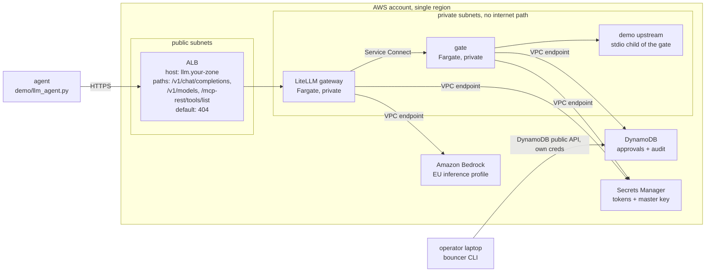
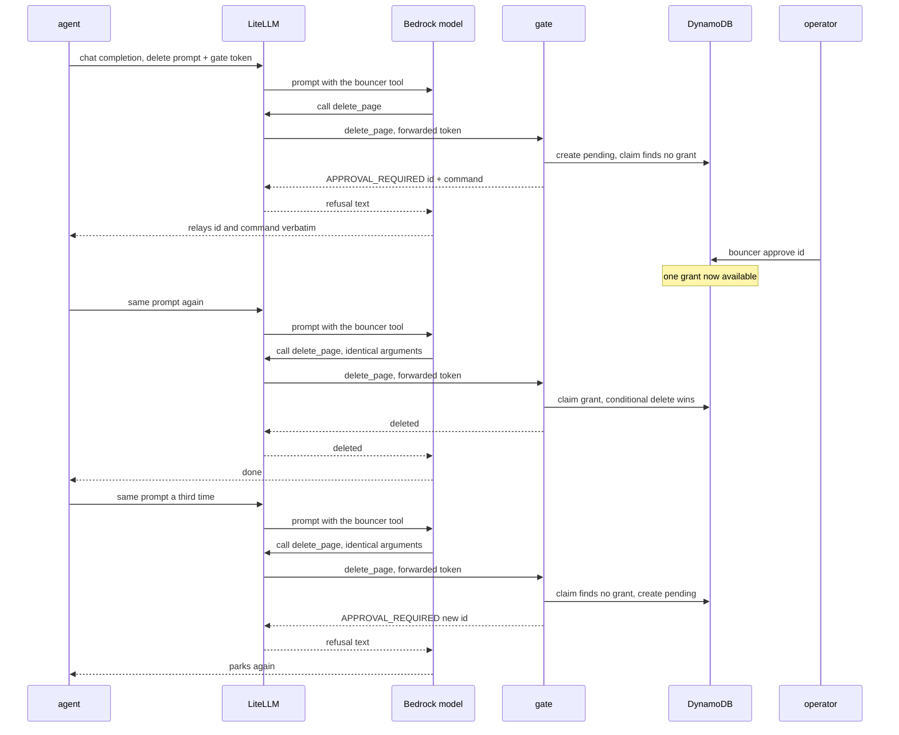

# Design

Why mcp-bouncer is built the way it is. `README.md` shows how to run and deploy
it; this document records the reasoning behind the pieces, so a later change can
tell a deliberate decision from an accident. `REQUIREMENTS.md` is the contract
it all answers to.

## What this is

mcp-bouncer is a governance proxy for [Model Context Protocol](https://modelcontextprotocol.io/)
tool calls, deployed as a working proof of concept on AWS. It sits transparently
in front of an upstream MCP server: an agent speaks to the bouncer exactly as it
would to the real server, and only the calls the policy allows ever reach the
upstream. Every call is classified `read`, `write`, `destructive`, or `unknown`.
Reads and writes pass, destructive calls are parked until a human approves them,
and anything the policy does not recognise is denied. Agents reach both models
and tools through one LiteLLM gateway: model calls go to EU-only Amazon Bedrock,
tool calls go through the gate, and the gate is reachable from the gateway and
nowhere else.

It refuses to be more than that. It does not decide *who* may approve a parked
call — anyone who can reach the store can. It does not redact or mask tool
results, inspect tool output for prompt injection, or attribute model calls to
individual agents. It is a POC whose value is a small, complete story about
classification, human-in-the-loop approval, and a deployment that keeps models
in one region and the tool path off the internet — not a product.

## Gate design

**Classification follows reversibility, not mutation.** The interesting boundary
is not "does this change something" but "can this be undone". A write to a store
that keeps revision history is one revert away from harmless, so it is `write`;
the identical write to a store with no history destroys what was there, so it is
`destructive`. Because the distinction is about the store behind a tool and not
about the tool's shape, it lives in `policy.yaml` and never in code:
`wiki.write_page` ships as `write` on the stated assumption that the wiki keeps
history, and repointing it at a historyless store is a one-line reclassification.

**Unknown is denied by default.** A tool matching no policy entry is `unknown`,
and `defaults.unclassified` accepts only the value `block`. A gate that allowed
what it could not classify would not be a gate — the first tool an upstream adds
would run ungoverned until someone noticed. The demo makes this concrete: the
upstream serves `wiki.rename_page`, `policy.yaml` deliberately does not list it,
and the gate denies it as unclassified. That is the realistic case, an upstream
growing a tool ahead of the policy, rather than a contrived one.

**Annotations may only escalate.** MCP tool annotations (`readOnlyHint`,
`destructiveHint`, `idempotentHint`) are supplied by the upstream server, which
the gate does not control, so they are untrusted hints. The policy engine lets
an annotation *raise* a classification — an upstream that flags a listed tool as
destructive is believed, because it is asking for more caution — but never lower
one, and no annotation can promote an unlisted tool into a permitted class. A
hostile or buggy upstream can therefore make the gate stricter and never looser.

**Park, notify, retry.** MCP has no pending state — a tool call either returns a
result or an error — so there is nowhere to model "waiting for a human" in the
protocol. The gate turns that constraint into the design: a destructive call
returns an error carrying an approval id and the exact command a human runs to
release it, the human approves out of band, and the agent retries the identical
call. The shape is forced by MCP, not chosen for its own sake, and it means the
actionable next step travels back to the caller inside the refusal itself.

**Grants are one-shot and argument-bound.** A grant is keyed to
`sha256(caller + tool + canonical-JSON arguments)`, so approving
`delete_page(title="home")` does nothing for `title="runbook"`, and it is
*claimed* rather than checked: the release consumes the grant atomically, so of
any number of concurrent callers holding the same approval exactly one wins and
the grant is spent. The claim happens before the call is released, so a claimed
grant is spent whatever happens next — the claim and the release cannot come
apart.

**Fail closed, everywhere.** Any internal exception, for any classification
including reads, blocks the call; there is no fail-open path. A classification
engine that has thrown cannot trust its own verdict, so the safe answer is to
deny even a read. Two details make this honest under scrutiny. The fail-closed
log line carries no exception object: an exception from below the middleware
could hold a tool argument or a credential in its message, so nothing is passed
into the log at all — the cost is no stack trace, the benefit is a class of leak
that cannot happen. And the best-effort audit write inside the failure path
swallows its own errors, because losing a log line must not turn an
already-blocked call into a raised one.

**The policy engine stays pure.** `gate/policy.py` does no I/O, imports nothing
third-party, holds no global mutable state, and is unit-testable without mocks.
Everything that needs the world — the store, the clock, the team lookup — is
resolved in the middleware and passed in as plain values. That is what lets the
poisoned-engine test assert that a broken classifier blocks reads, writes and
destructive calls alike: the engine has no hidden path to behave differently.

**The gate refuses to boot on a policy it cannot validate.** `load_registry`
either returns a fully validated registry or raises; there is no
partially-applied policy. A malformed rule, an unknown classification, or a team
override that loosens the baseline stops the process before it serves a single
request. The alternative — starting and hoping the bad rule is never hit — trades
a loud, immediate failure for a silent, latent one, which is the wrong trade for
a component whose whole job is to be trusted.

## Identity and teams

**Identity depends on transport, and that is two honest answers to two threat
models rather than an inconsistency.** Over stdio the client spawned the gate
process, so the spawning process's identity *is* the caller's identity and
trusting `--caller` is correct — a stdio server can only be spoken to by whoever
launched it. Over HTTP there is a network boundary, so a bearer token is
mandatory with no fallback, and if no token source is configured at all the gate
refuses to boot rather than authenticate nobody and pass everybody. Same
component, different transport, different honest answer.

**Session-level auth closed a pre-auth enumeration hole.** The MCP messages that
matter for reconnaissance — `initialize`, `tools/list`, `resources/list`, `ping`
— never reach the per-call hook, so enforcing identity only at tool-call time
left anyone past the network layer able to open a session and enumerate the tool
catalogue without a token. The fix authenticates the whole MCP session at the
HTTP layer, using fastmcp's native auth seam so the health route stays open,
with a thin verifier that delegates to the same token resolver the per-call
check uses. Enforcing at the ALB was rejected: it cannot verify a bearer token
(its built-in auth is a browser OIDC redirect an agent cannot follow), and
matching the header in a rule would put plaintext tokens in infrastructure
config and state and make rotation a redeploy. The per-call check is kept as
defence in depth, and it has its own test that drives the HTTP-configured gate
over the in-memory transport — because once the outer session guard rejects
every unauthenticated request, the inner check stops being reached and its tests
can silently hollow out.

**A team is a named override that may only tighten.** `policy.yaml` ships two:
`CustomerChat`, customer-facing and tightest — it promotes wiki writes to
`destructive` because an edit is visible to a customer the moment it lands and
revision history does not undo what someone already saw, drops its destructive
cap to one per hour, and halves the approval window — and `DevChat`, internal
tooling with more latitude, keeping writes passing and only lowering its cap. A
team may raise a classification, make an action stricter, or lower its own cap or
TTL; any loosening is a validation failure that refuses the boot.

The subtle part is that tightening is not only about numbers. Two of the
loosening routes are *positional*: a team could introduce a broad glob that
shadows a strict tool, or an exact name that outranks a stricter glob — matching
resolves by exact-name-then-first-glob-in-file-order, so either move changes
which rule applies without lowering any value. Comparing severities alone would
miss both. The rule that actually blocks them is narrower and catches both at
once: a team may only override keys the baseline already lists. A team cannot
name a tool the baseline does not classify, so it cannot introduce a shadowing
pattern in the first place.

**Unknown teams fall back to the baseline, and that is safe only because of a
boot-time invariant.** `registry.for_team` returns the baseline view for a team
it does not recognise, which looks lax in isolation. It is safe because every
token's team is validated against the policy at boot — the Terraform that writes
the token secret fails at plan time if a caller names a team `policy.yaml` does
not define, and the gate refuses to boot on such a token — so an unknown team can
never arrive over HTTP. The fallback is a defence-in-depth default for a case the
invariant already prevents, not a live code path.

**Adding a team is configuration, not code:** one block in `policy.yaml` and one
token. **Token rotation needs a restart:** the token table is read once at boot,
so a rotated secret does not take effect until the task recycles. That is
deliberate for a POC — a cache with a TTL is the obvious next step — but it is
stated rather than left for an operator to discover when a freshly minted token
is rejected.

## Storage

**Porting SQLite to DynamoDB was a test of the interface.** The DynamoDB store
was written to satisfy the existing `ApprovalStore` surface structurally, adding
nothing to it — the middleware never learns which backend it holds, selected by
one environment variable. One change to the interface was needed and it is worth
recording rather than hiding: `create()` gained a per-approval TTL. That came
from a real bug (below), was reported, and was accepted; the point of a
requirement that says "report an interface change rather than make it silently"
is that the one change that happened is visible.

**The one-shot claim is a conditional delete.** On SQLite the guarantee holds
across processes that share one file; a horizontally scaled gate has many Fargate
tasks and no shared disk, so it needs a claim that holds across hosts. On
DynamoDB the release is a conditional `DeleteItem` on the grant's exact key with
the expiry check inside the same condition, so exactly one of any number of
concurrent hosts deletes the item and sees success, and the same condition
rejects a grant that has expired but that TTL has not yet swept.

**TTL is enforced twice** because DynamoDB's native TTL is a background sweep,
not a read-time guarantee: an expired grant can linger for minutes before it is
removed. So the application refuses to honour a grant it reads past its expiry
even though the row still exists, and native TTL eventually reclaims the space.
The first keeps the guarantee correct; the second keeps the table from growing.

**The hot-partition ceiling is real and named.** The pending-enumeration query
uses a constant GSI partition value (`PENDING`), the dedup lookup a constant
per-hash value, and the audit table a single constant `AUDIT` partition. That is
exactly what makes `list_pending` and the audit reads a `Query` rather than a
`Scan`, and it is fine at POC volume — but a constant partition caps write
throughput, and at real scale these would be re-keyed to time-bucketed
partitions. Stating it here is cheaper than letting a reader discover it under
load.

**The two backends are not byte-identical under rapid retries,** because GSI
reads are eventually consistent. The create path deduplicates a pending row by
querying the hash GSI before inserting, and a retrying agent can beat that read's
consistency window and park a second pending row where SQLite, reading its own
write immediately, would reuse one. This is cosmetic — a duplicate pending row,
not a duplicate release — and it cannot weaken the one-shot guarantee, which
rests on the conditional delete of the *grant*, not on pending dedup. It is
already commented at the point it happens.

**The destructive rate cap is best-effort under concurrency, and that is a
deliberate choice.** The cap has a genuine time-of-check-to-time-of-use gap.
Reading the code: `middleware._evaluate` counts the caller's approved releases
in the rolling window (`gate/middleware.py:115`, calling `approved_in_window`)
and then decides against that count (`gate/middleware.py:119`, where
`policy.decide` applies the `approved_destructive_in_window >=
destructive_per_hour` test at `gate/policy.py:100`) — *before* it records the
current release, which happens only when the grant is claimed at
`gate/middleware.py:126` (`consume`, whose `INSERT INTO releases` at
`gate/approvals.py:276` is exactly what `approved_in_window` counts). So N
approved grants for the same caller, fired concurrently, each read a window count
that does not yet include the others' releases; each can pass the cap check on
that stale count, and the caller can overshoot a cap smaller than N. The window
is small — the read, the decision and the claim are close together — but it is
real, so the cap is a throttle enforced *per evaluation*, not a hard ceiling
across simultaneous evaluations.

What the cap *does* guarantee is unchanged: it throttles **human-approved**
destructive work, because every destructive call has already been parked and
released by a human before it can count against the cap at all — the cap stands
between an operator and approving too much, not between an agent and damage. What
it does *not* guarantee is a hard ceiling when several distinct approved grants
race. The accepted trade, per the owner: closing the gap means moving the count
into the conditional claim in `consume()` — the one piece that is airtight and
proven live to release exactly once — and a bug there would cost the one-shot
guarantee, which is the property the whole design rests on. Trading an
exploitable double-release for a soft cap on already-approved work is the wrong
direction, so the cap is documented as best-effort rather than made atomic.

**None of this touches the one-shot per-grant guarantee.** That guarantee is a
property of the *claim*, not the count: the conditional delete admits exactly one
release per grant even under concurrency, so a cap overshoot means "more approved
grants ran this hour than the cap nominally allows", never "one grant released
twice". This was observed live from both directions — one grant, ten concurrent
identical retries, one released and the rest parked or blocked; and separately at
the store level with twenty independent OS processes racing one grant on the real
table, one winner each of three runs. Both runs drove their clients from a single
laptop, so this is multi-client evidence, not multi-host; the cross-host claim
still rests on the conditional delete being a single atomic DynamoDB operation.

## The LLM gateway

**A gateway is the only path to models and tools** so that "agents reach models
and tools only through here" is an architectural fact rather than a convention.
LiteLLM runs as its own Fargate service behind the existing ALB; it presents the
OpenAI chat-completions API for every backend and translates to Bedrock Converse,
so an agent speaks one API and never holds Bedrock credentials, and the tool gate
is registered as an MCP server inside LiteLLM so an agent never addresses an
upstream tool server directly. Putting both the model path and the tool path
through one component is what lets the deployment make a single, checkable claim
about egress and region.

**EU-only is enforced in three independent layers, on purpose.** LiteLLM's model
list names only the `eu.` inference profile, so any other model name is refused
before it reaches Bedrock (a `us.` or `global.` profile returns a 400). IAM
allows `bedrock:InvokeModel` and `bedrock:InvokeModelWithResponseStream` only on
that profile and, for the foundation-model
ARNs it routes to, only under a condition tying the call to the profile — so the
task role can reach the underlying models only *through* the EU profile, never
directly. The `bedrock-runtime` VPC endpoint policy is resource-scoped to the
same ARNs. Three layers rather than one because they fail independently: the
config layer is a one-line edit away from wrong, IAM is the durable backstop if
the config drifts, and the endpoint policy is what still holds if a future model
entry is added carelessly. IAM and the endpoint policy also *intersect* — a call
must satisfy both — so each is a real boundary, not decoration. The model id and
the authorised ARNs are pinned to one source: a test asserts the config's model
matches the Terraform variable, and the ARNs come from a data-source lookup of
the profile with a postcondition that every routed region begins with `eu-`, so
they are looked up, not typed.

**ECS Service Connect over Cloud Map DNS,** chosen for health-aware routing,
built-in metrics, and the production-shaped pattern, accepting that the sidecar
is not free: AWS recommends adding CPU and memory per task for the proxy, which
pushed the gate task up a Fargate size, and the sidecar runs an Envoy that emits
its own log stream (which the execution role must be allowed to write, or the
task fails to start). The gate is addressed by its Service Connect name inside
the mesh, so no private DNS zone is needed and no IP or domain is baked into the
gateway config.

**Timeouts are set explicitly because the defaults would bite.** Service
Connect's per-request timeout defaults to 15 seconds and its idle timeout to five
minutes; a completion with several model and tool rounds can exceed 15 seconds,
so per-request is raised to 120 and idle to 300, and the ALB idle timeout is
raised from its 60-second default to 300 to match. The demo agent's own client
timeout sits at 110 seconds, just under the per-request limit, so a slow turn
surfaces as a clean local timeout rather than an opaque mid-stream cut. None of
these were measured against a worst-case turn; they are pre-emptive, and stated
as such.

**The shared master key is a stated limitation, not a hidden one.** Without a
database LiteLLM has no virtual keys — a wrong key returns "no connected db", and
the only credential is the master key, which is also LiteLLM's admin key. Every
agent shares it for model calls, so model calls carry no per-agent attribution
and there are no per-agent budgets or model allowlists. This is the lean choice
for a POC; the compensating controls are that the key is a generated,
Secrets-Manager-only secret that never appears in config or image, and that the
ALB exposes only the two OpenAI paths plus one preflight path and the admin UI is
disabled — shrinking the reachable surface is what is affordable without a
database. The revisit trigger is explicit: more than a demo's worth of agents, or
any need for per-agent spend or model allowlists, means adding a database and
virtual keys.

**Per-agent identity survives for tool calls** even though it is absent for model
calls: each agent forwards its own gate token per request inside the MCP tool's
headers, LiteLLM strips the forwarding prefix and passes it to the gate, and the
gate attributes and governs the call by that token. The static credential
configured for the gate server is deliberately one the gate will never accept, so
an agent that forgets its header is refused rather than silently defaulted to a
working credential — fail closed, not fail open. A missing gate token therefore
fails closed but *silently*: the gate returns 401, LiteLLM drops the tools, and
the model answers as if it never had them.

**LiteLLM is inside the gate's identity trust boundary — the finding worth the
whole security pass.** Because each agent forwards its *own* gate token through
LiteLLM on every request (`x-mcp-bouncer-authorization` in
`gateway/litellm.yaml`'s `mcp_servers.bouncer` and in `demo/llm_agent.py`), the
gate re-resolves the caller's identity from that forwarded header on each call
(`gate/middleware.py` opts `authorization` back into the headers it hands the
resolver; `gate/identity.py` maps the bearer token to a caller and team), and the
Service Connect hop from LiteLLM to the gate is **plain HTTP on port 8000 with no
TLS** (`terraform/app/ecs.tf`, addressed as `http://gate:8000/mcp`). LiteLLM
therefore sees every caller's gate token in clear. The consequence is sharper
than the shared-master-key limitation stated earlier: that says only that
*model* calls are unattributable per agent. This says that a compromise of
the LiteLLM task means the ability to **impersonate any caller to the gate**,
because the attacker holds every caller's tool credential — the per-agent
identity that survives for tool calls is only as trustworthy as the gateway that
relays it. The real fixes both have real costs. A **trusted identity header** —
LiteLLM asserting the caller identity and the gate trusting it — needs a gate
change *and* a proof that only LiteLLM can reach the gate; the security group
already gives the latter (the gate admits port 8000 from the LiteLLM security
group alone, R52), so this is the smaller of the two once the gate learns to
trust a header. **Per-agent virtual keys** would let LiteLLM bind each agent to
its own credential, but they need LiteLLM's database — the Postgres the lean POC
deliberately left out. Neither is built; the boundary is stated so a reader knows
exactly what a gateway compromise buys.

**Five more accepted-and-documented boundaries, none fixed for the POC.** The
audit log is append-only *against the workload* — structurally (no update/delete
path), by the task role's `PutItem`+`Query` IAM, and by the DynamoDB endpoint
policy's own statement — but **not against a principal using the account's own
credentials from outside the VPC**: an endpoint policy binds only traffic that
traverses the endpoint, so a laptop with the right IAM rights reaches the table
directly and the endpoint constraint never applies. The production answer is a
separate log-archive account the workload account cannot write over, which is out
of scope here. The **HTTPS listener sets no HSTS**: the `:443` listener
(`terraform/app/alb.tf`) terminates TLS and the `:80` listener 301-redirects to
it, but no `Strict-Transport-Security` response header is emitted, so a client
that first speaks plain HTTP is not told to pin HTTPS for future requests. Low
risk here — the allowlist means the one caller is the operator and the redirect
already upgrades the connection — but named rather than implied. **Unauthenticated
requests generate attacker-drivable auth-rejection log volume**: every call the
gate refuses before classification writes an operational log line and a
best-effort audit line (`gate/middleware.py` `on_call_tool`, the
`AuthenticationError` branch calling `observability.log_auth_rejected` and
`_audit_best_effort`), so anyone who can reach the gate can inflate log volume
without ever authenticating. It leaks nothing (the line carries a fixed reason
and never a token) and the security group already limits who can reach port 8000
to the LiteLLM task, so the exposure is bounded; it is named because log-volume
cost is not zero. The **argument hash binds the wire representation, not semantic
equivalence**: it is `sha256` over the canonical JSON of the arguments, so two
requests that mean the same thing but serialise differently hash differently and
would each need their own approval — it **fails safe** (it can over-park, forcing
a second approval, never under-park into releasing a call the human did not see).
And approve-time versus consume-time **clock skew shifts the effective TTL
window**: the TTL is stamped when the call is parked and evaluated when the grant
is read, so skew between whichever hosts do each can lengthen or shorten the real
usable window by that skew — bounded and small in one region, worth naming rather
than implying the window is exact.

**The preflight exists because that silent drop can be actively misleading.** In
a live run with its tools dropped, a model did not say it could not act — it
emitted a plausible imitation of this project's own approval protocol, with a
fabricated tool call, a fabricated approval id, and a fabricated `approve`
command. Nothing ran: no tool existed to call, the gate saw no request, the audit
log recorded nothing, and the store rejects an id it never issued. But an
operator who trusted the model's text rather than the gate's audit log could be
fooled into "approving" an id that never existed. This was seen once in two
attempts — on the repeat the model answered honestly — so it is non-deterministic,
which is precisely the argument for a deterministic fix rather than a prompt
tweak: a prompt cannot be relied on to produce the honest answer. The demo agent
therefore runs a preflight before the model is ever asked — it queries the
gateway for the bouncer's tool list with the same credentials the tool call would
use, and exits non-zero on zero tools or any error — and the documentation states
plainly that approval ids come only from the gate. A rejected gate token (the
rotation case, since the gate reads its table once at boot) surfaces on that
preflight route as a 401 rather than an empty list, so the preflight message names
both candidate credentials because from the agent they are indistinguishable.

**Prompts and responses are not logged.** LiteLLM's message logging is turned
off, so the CloudWatch stream carries request metadata and decisions but no
prompt or completion content. The cost is paid at debugging time: a
misbehaving turn cannot be reconstructed from the logs, and reproducing it means
re-running the prompt. For a POC that keeps content out of a log group entirely,
that is the accepted trade.

## Observability

**One dashboard, built only from what the stack already emits.** The `app/`
stack defines a single CloudWatch dashboard (`terraform/app/dashboard.tf`) whose
name comes from the project name and whose body is `jsonencode`d from Terraform
references — every service name, table name, ARN suffix, dimension value and the
region is a reference, never a literal, so nothing account-specific is committed.
It has four observation rows and an SLI row:

- **Platform health.** Both Fargate services (CPU, memory, running task count),
  the ALB healthy-host count for the LiteLLM target group (the gate has none —
  it is internal-only), the Service Connect gate hop (requests, p95 response
  time, 2xx/4xx/5xx), and both DynamoDB tables. DynamoDB latency and system
  errors are published only on the `(TableName, Operation)` dimension pair, never
  on `TableName` alone, so those widgets name the operations the store actually
  issues (`GetItem`/`PutItem`/`Query`/`DeleteItem`), per the DynamoDB metrics
  documentation.
- **Gateway traffic.** ALB request count, target response time p50/p95, and the
  4xx/5xx split into ELB-generated versus target-generated, so a gateway fault is
  distinguishable from an upstream one.
- **Model.** Bedrock invocations, invocation latency p95, input/output token
  counts and the output:input ratio, and errors split client/server/throttle.
  The `ModelId` dimension value is the inference profile id (the `eu.` profile),
  taken from the Terraform variable.
- **Governance, per team.** Decisions by classification and by outcome, unknown
  tool denials, parks (a `decision=approve` outcome), auth rejections, and the
  fail-closed count — all per team, from metric filters on the gate's JSON
  decision log.

**Where each number comes from.** The AWS-namespace rows read the metrics ECS,
the ALB, DynamoDB and Bedrock publish automatically. The Service Connect gate hop
reads the two dimension families ECS actually publishes: the inbound
`RequestCount` on `(DiscoveryName, ServiceName, ClusterName)` (the gate is the
server), and the target-attributed series (`HTTPCode_Target_*`,
`TargetResponseTime`) on `TargetDiscoveryName` alone — the target metrics are
attributed to the *calling* service, and the caller here is a client-only Service
Connect config, so the single-dimension set aggregates the hop across callers
without depending on a client `ServiceName` CloudWatch may not stamp. The
governance row is backed
by new CloudWatch Logs metric filters over the gate's structured log
(`aws_cloudwatch_log_group.task`): they key on `$.event` exactly as the existing
fail-closed filter does, count `decision`/`fail_closed`/`auth_rejected` lines,
and carry **only `team`** as a dimension. `caller`, `tool` and `args_hash` are
never dimensions — they are unbounded and would both explode custom-metric
cardinality and surface identity or argument detail the dashboard must not show.
`team` is bounded by `policy.yaml` (every caller's team is validated at boot), so
its cardinality is the number of teams. No widget — metric or the few text
panels — carries prompt, response or tool-argument content; the governance
metrics are counts over bounded enum fields, so there is no content path to leak.

**Why model SLIs are platform-wide.** Model-call indicators cannot be attributed
to a team: with a shared master key and no per-agent gateway keys, a model call
carries no team identity (there is no per-agent database to bind it to), so
Bedrock usage is measured platform-wide. Tool-call governance *is* per team,
because each tool call carries the caller's forwarded gate token and the gate
resolves the team from it. The dashboard states this in a visible text panel so a
viewer is not left to infer it.

**"No data" versus zero.** CloudWatch only creates a metric once it has been
emitted, so a widget on a metric that never fires in a healthy stack — a 5xx
count, a Bedrock server error, a throttle, a team that sent no traffic yet — would
read "no data" rather than 0, and a dashboard row that reads blank is
indistinguishable from a broken one. Every such series is therefore drawn through
metric math `FILL(m, 0)`, so a healthy stack shows a flat zero line and every row
shows data. A wrinkle forced this shape: a metric filter that assigns dimensions
**cannot** also declare a filter default value, so the per-team governance metrics
cannot fall back to 0 at the filter; `FILL` in the widget is the only way to make
a quiet team read 0. The one exception is the total, undimensioned `FailClosed`
filter, which keeps its filter `default_value = 0` — and that filter and its alarm
are left exactly as they were.

**The fail-closed line now carries `team`.** `log_fail_closed` gained a `team`
field so the fail-closed rate can be read per team. It is `null` when identity
failed before the caller was known — an honestly unattributed block, never
guessed. A CloudWatch metric-filter dimension is published only when the field is
present in the log line, so a null-team fail-closed is not counted by the
per-team `FailClosedByTeam` metric. That would silently drop it, so the dashboard
also reads the existing undimensioned `FailClosed` total and computes
`unattributed = total − Σ(per-team)` via metric math, floored at zero, and labels
it "unattributed" — so a block that could not be attributed is still visible
rather than lost.

**Service levels are shown against illustrative targets.** The SLI row shows
gateway availability (`1 − (target 5xx + ELB 5xx) / requests`, target 99.5%),
gateway end-to-end latency p95 (ALB target response time, target 30 s), error
rate split by class (target under 1%), model latency p95 (Bedrock invocation
latency, target 15 s), the output:input token ratio, and the gate fail-closed
rate per team (target 0%). Each target is drawn as a horizontal annotation whose
value comes from one `locals` block, and attainment over the viewed range is
shown as a single value where CloudWatch can express it. **The targets are
illustrative for a demo workload, and the two latency targets are provisional** —
placeholders to be replaced by a measured baseline from the live run, not
negotiated SLOs. The token ratio is shown deliberately **without** a target,
labelled that a normal band needs history this demo does not have.

The availability and error-rate SLIs divide by the load balancer's total request
count, while target 5xx is counted on the gateway's target group alone. The total
also includes requests the load balancer answers itself (the HTTP-to-HTTPS
redirect and the 404 for any other host), which can never produce a target 5xx,
so both SLIs lean slightly optimistic. With one target group the effect is
small, but it always errs towards looking healthier.

**What is deliberately absent from the dashboard, and why.** Four indicators are
named as absent rather than approximated: time to first token (the gateway calls
Bedrock non-streaming, so `TimeToFirstToken` has never been emitted), fallback
engagement (one model, no fallback), cache hit rate (no prompt caching), and cost
in currency (pricing would have to be hardcoded, which would silently go stale in
the no-internet VPC — token counts are shown instead, from which cost can be
derived out of band).

**Alarms are deliberately limited to the fail-closed one.** These widgets are for
observation, not paging; per REQUIREMENTS §8, alarms and paging on service levels
are out of scope, and the single alarm remains the fail-closed signal that a task
booted and then lost its store while the shallow health check still passes.

## Deployment

**Two Terraform stacks, and bootstrap is never destroyed.** `bootstrap/` holds
the Route53 hosted zone, the ACM certificate, and two ECR repositories;
everything else is in `app/`, which is applied and destroyed freely. Bootstrap
carries `prevent_destroy` and has no teardown path by design, for two reasons
that share a shape: the zone's name servers are what a registrar delegates to by
hand, so recreating the zone would issue a different set and break the delegation;
and the images must outlive a teardown or the next apply would have nothing to
run. Everything in `app/` is cheap to recreate, so it stays disposable.

**The certificate lives in bootstrap with no validation resource.** In the app
stack it would be reissued and revalidated every apply cycle. More sharply, an
`aws_acm_certificate_validation` resource blocks until the validation record
resolves publicly, which cannot happen before the manual registrar delegation —
a step that happens *after* the first apply — so including it would make the very
first apply hang until it timed out. Instead bootstrap requests the certificate
and publishes the validation records (both of which work immediately), ACM
finishes validation on its own once delegation is live, and the app stack looks
the certificate up filtered to `ISSUED`, so a premature apply fails fast with a
clear message instead of hanging.

**The container spawns its upstream over stdio** rather than carrying a
deployed-only code path. The image runs `bouncer-server --upstream
demo/wiki_server.py --transport http` — the same command a developer runs
locally, only with a non-loopback bind and AWS-backed stores selected by
environment. There is no branch that behaves one way in tests and another in
production, so what the test suite exercises is what runs.

**No NAT, no internet path, VPC endpoints only.** The task talks to a fixed set
of AWS services — ECR and its S3 layer bucket, CloudWatch Logs, Secrets Manager,
DynamoDB, and (for the gateway) Bedrock — so it needs no internet at all, and
"the proxy has no path to the internet" becomes a claim the deployment can
demonstrate rather than assert. The accepted consequence is that any unexpected
outbound call at boot fails instead of silently working, which is treated as the
empirical test of the no-egress design. Each endpoint additionally carries a
**resource-scoped policy**, because a bare endpoint accepts requests signed by
any account's credentials — a compromised container could exfiltrate to an
attacker's own in-region bucket or table through the endpoint, shrinking "no path
out" to "only AWS services, any account". The endpoint policies pin each endpoint
to exactly this deployment's resources and intersect with the IAM policies, so
each is a separate enforcement layer. A least-privilege detail here caused a
first-apply ordering bug worth remembering: naming the exact role ARN in an
endpoint policy's principal is resolved at endpoint-creation time and raced IAM
propagation on a fresh apply, so the principal is expressed as `Principal "*"`
plus an `aws:PrincipalArn` condition instead — identical scoping, but compared at
request time, so the race should not recur. The reasoning is that a condition key
is not resolved at policy-validation time; it has not yet been re-proved on a
clean destroy-and-apply, so it is stated as expected rather than demonstrated.

**The network allowlist and the bearer token are both present because each buys
something the other cannot.** The ALB security group admits only an
operator-supplied set of source IPs (discovering the applier's own address by
default), and the gate demands a bearer token for the whole session. An allowlist
is *network location*, not identity: on a shared NAT or a VPN exit, everyone
behind it passes, so it narrows who can reach the door but says nothing about who
they are. The token is identity but not location: it says who a caller is but not
where they are allowed to knock from. Together they are defence in depth; neither
alone is what "callers authenticate" means.

**Least privilege lands in specific IAM shapes.** The task role gets exactly the
DynamoDB actions the store issues, on exactly its two tables and the approvals
table's two GSIs — no `Scan`, no `BatchGetItem` — and `GetSecretValue` on exactly
the token secret. The audit table gets `PutItem` and `Query` only: append-only is
enforced in three places at once — structurally (the store has no update or
delete path), by IAM (no `UpdateItem`/`DeleteItem` grant), and by the DynamoDB
endpoint policy's own statement for that table. The execution role uses an inline
policy rather than the AWS-managed `AmazonECSTaskExecutionRolePolicy`, which
grants ECR and Logs actions on `Resource "*"`; the only wildcard left anywhere is
`ecr:GetAuthorizationToken`, which AWS scopes to the whole registry and refuses
to qualify with a resource ARN.

**The operator approves from a laptop against the remote store.** Because the
approval store is DynamoDB and its public API is reachable with the operator's own
AWS credentials, `bouncer list` / `approve` / `log` run from a laptop with no VPN
or bastion — the CLI is a pure executor against the same table the gate writes,
and the operator's own credentials must allow the DynamoDB actions. The gate
stamps the caller's team TTL on a parked call at park time, so the CLI never needs
to know team policy to compute a grant's lifetime; making the CLI team-aware
instead would let a stale local copy of `policy.yaml` decide a grant's lifetime
and silently loosen it, which is exactly what the tighten-only rule exists to
prevent.

**The health check is shallow on purpose,** and production would differ. The gate
refuses to boot on an unreachable store, so a task that is serving has already
proved reachability once; a deep per-probe check would hit DynamoDB every few
seconds and would replace a healthy task on a transient blip, trading a safe,
localised failure for lost capacity. Fail-closed means a mid-life store loss
blocks calls rather than mis-serving them, so the operational signal for that case
is a CloudWatch metric filter and alarm on the `fail_closed` log event, not the
health probe. What production would do differently is a separate startup-only deep
check with hysteresis, so a blip does not flap a task out of service.

A few smaller deployment facts are worth stating rather than leaving implicit.
The gateway addresses the gate as `http://gate:8000/mcp` with no trailing slash,
because a request to `/mcp/` triggers fastmcp's trailing-slash 307 redirect and
the extra round-trip is pointless when the caller can name the canonical path
directly. In the deployed system the gate is internal-only — reachable from the
gateway over Service Connect and nowhere else, with no ALB target group and no
TLS-terminating proxy in front of it — so the earlier scheme-downgrade concern
does not apply here: there is no `X-Forwarded-Proto` to trust and `ecs.tf`
deliberately omits `FORWARDED_ALLOW_IPS` for that reason. The gate suppresses
its `Server:` and `Date:` response headers, which matters only because one
endpoint is unauthenticated and an ALB does not strip them; the ALB re-adds its
own `Date:`, so the suppression is about the app's fingerprint, not the date.
Host/Origin (DNS-rebinding) protection is not enabled on the bind — fastmcp's
default guard applies only to loopback-bound servers and the container binds
`0.0.0.0` — which is low risk behind an ALB that sets `Host` but is stated rather
than assumed. And log-stream purity is deliberately partial: everything the gate
itself emits is one JSON object per line, but boot-time output from uvicorn,
fastmcp, and the separate upstream process is not, which is accepted because that
noise is bounded to roughly twenty lines once per task start and unparseable lines
simply do not match a CloudWatch metric filter.

## Absences

The out-of-scope list in `REQUIREMENTS.md` is deliberate, and the items that
would change first if this had to become real are specific.

- **Approver authorisation.** Anyone who can reach the DynamoDB table can approve
  a parked call; the store does not record or check who approved. This is the
  first thing to build for anything beyond a POC: an approver identity on the CLI,
  written into the audit row, and an IAM boundary between agents and approvers.
- **Per-agent gateway keys, model allowlists, and budgets.** All three need
  LiteLLM's database, which the lean design left out. Adding Postgres and virtual
  keys is the change, and its trigger is stated above: more than a demo's worth of
  agents, or any need for per-agent spend or model control.
- **A cache for the token table** with a TTL, so token rotation does not require a
  task restart.
- **A startup-only deep health check with hysteresis,** so a real deployment gets
  liveness detection the shallow probe cannot give without flapping.
- **Re-keyed DynamoDB partitions** (time-bucketed) for the pending, dedup, and
  audit access patterns, before write throughput hits the constant-partition
  ceiling.
- **A measured baseline behind the two provisional latency targets.** The
  dashboard's gateway and model latency SLIs ship with provisional targets
  (30 s and 15 s); replacing them with a target derived from the live run is the
  first thing to firm up once real traffic exists. The other targets are
  illustrative for a demo workload and would likewise be renegotiated for a real
  one.
- **Alarms and paging on service levels.** The dashboard observes; it does not
  page. The only alarm is the fail-closed one. Real operation would add SLI
  alarms with burn-rate windows once the targets above are measured rather than
  provisional.
- Not built at all, and not planned: result masking or redaction, prompt-injection
  detection in tool output, a UI beyond the CLI, multi-region / autoscaling /
  disaster recovery, Redis, external model providers, and trace storage such as a
  self-hosted tracing backend (which would need either heavy data stores or
  internet egress that the no-egress design forbids).

## Diagrams

### Deployment topology

### Park, approve, retry with a model in the loop

