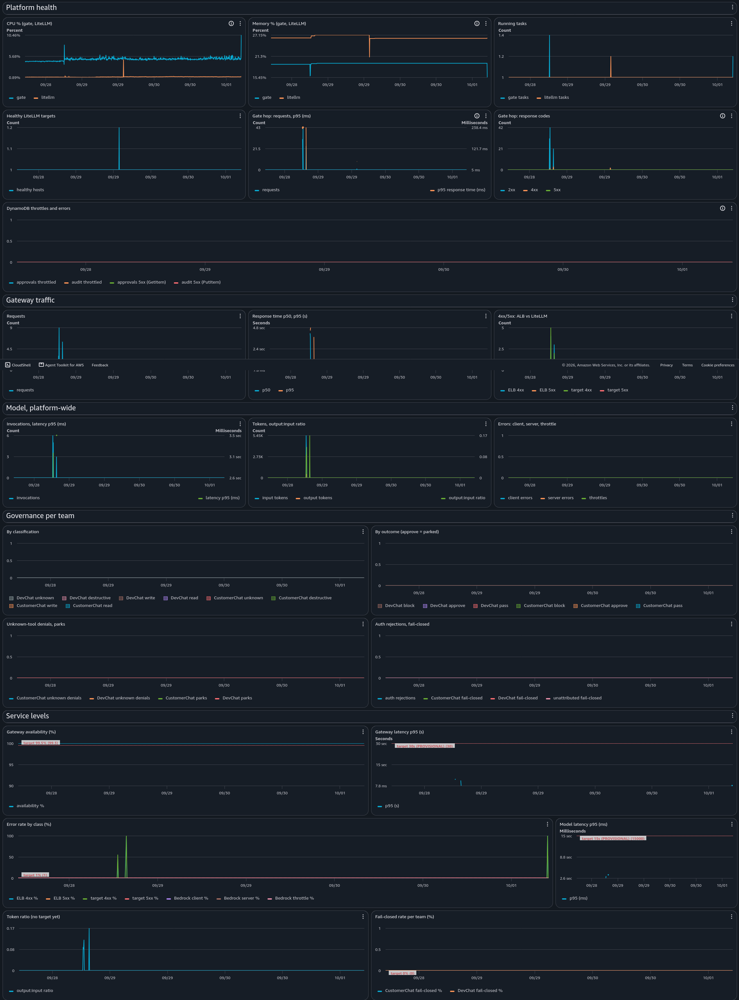

# mcp-bouncer

An AI platform on AWS built around an MCP governance gate: a single LLM gateway,
EU-only models, a private tool gate where destructive calls wait for a human,
and observability.

The gate is a governance proxy for [Model Context Protocol](https://modelcontextprotocol.io/)
tool calls. It sits transparently in front of any upstream MCP server, so an agent
talks to the bouncer exactly as it would to the real server, and only calls the
policy allows ever reach it.

Every tool call is classified:

| Class | What happens |
|---|---|
| `read` | passes through |
| `write` | passes through |
| `destructive` | **parked** until a human approves it |
| `unknown` | **denied**: a tool the policy does not recognise |

An approval is one-shot and bound to the exact arguments it was granted for.
Approving `delete_page(title="home")` does nothing for `title="runbook"`, and it
releases exactly one call.

## What is in this repo

Two things, built to work together.

**The gate.** The MCP governance proxy above: a Python package with its own
tests and a demo that runs locally in two minutes with no AWS account.

**A small AI platform around it, on AWS.** The `terraform/` stacks deploy the
basic pieces a team would put in front of agents:

- **One way in.** A LiteLLM gateway is the only path to models and to tools. It
  sits behind an HTTPS load balancer on your own domain, limited to an IP
  allowlist.
- **EU-only models.** Claude on Amazon Bedrock through the EU inference profile,
  pinned in three places: the gateway's model list, IAM, and the VPC endpoint
  policy.
- **A private gate.** The gate has no public entry point. Only the gateway can
  reach it, over ECS Service Connect, and each agent forwards its own token so
  every tool call is attributed to a caller and a team.
- **No internet path.** Both services run in private subnets with no NAT. They
  reach AWS only through VPC endpoints, each with a policy scoped to the
  resources the stack actually uses.
- **State and secrets.** Approvals and the audit log in DynamoDB, tokens and the
  gateway key generated at deploy time and kept in Secrets Manager.
- **Observability.** Structured logs from both services in CloudWatch, ALB
  access logs in S3, an alarm when the gate fails closed, and a CloudWatch
  dashboard covering platform health, gateway traffic, model usage, the gate's
  decisions per team, and service levels against their targets.



It is a proof of concept on Fargate, not a product: one task per service, one
region, and the limits listed under [Known limitations](#known-limitations).

## Why classification follows reversibility

The class boundary is not "does this change something" but **"can this be
undone"**. `wiki.write_page` ships as `write` on the assumption that the store
behind it keeps revision history, so an overwrite is one revert away from
harmless. Point it at a store with no history and the same tool destroys the
previous content. It belongs in `destructive`. That is a one-line change in
`policy.yaml`, never a code change.

## Quickstart

Requires Python 3.10+.

```bash
python3 -m venv .venv && . .venv/bin/activate
pip install -e '.[test]'
pytest
```

The tests are the fastest way to see what the component actually guarantees: a
read passes, an unknown tool is denied, a destructive call parks, an approval
releases exactly one call, a replay is refused, and a poisoned policy engine
blocks everything including reads.

## The demo: park, notify, retry

The point of the bouncer is that a destructive call cannot run until a human says
so. MCP has no "pending" state to model that in, so the gate returns an error
carrying an approval id, a human approves out of band, and the agent retries the
identical call.

**Terminal 1.** Run the gate in front of the bundled demo wiki. Over HTTP the
gate needs to know which tokens map to which callers, so hand it one:

```bash
export BOUNCER_TOKENS='{"demo-token":{"caller":"agent-1","team":"DevChat"}}'
bouncer-server --upstream demo/wiki_server.py --transport http --port 8000
```

**Terminal 2.** Play the agent, then the operator. Run these from the same
directory, so the `bouncer` CLI reads the same local database the server writes:

```bash
export BOUNCER_DEMO_TOKEN=demo-token

python demo/agent.py wiki.read_page '{"title": "home"}'      # passes
python demo/agent.py wiki.rename_page '{"title": "home", "new_title": "index"}'  # unknown: denied
python demo/agent.py wiki.delete_page '{"title": "home"}'    # parks, prints an id
```

The delete deletes nothing. The gate writes a pending record and returns:

```
APPROVAL_REQUIRED id=ab12cd34ef56 :: wiki.delete_page is classified 'destructive'
and needs human approval before it runs. Ask an approver to run:
bouncer approve ab12cd34ef56 -- then retry this call unchanged.
```

The operator inspects and releases it:

```bash
bouncer list
bouncer approve ab12cd34ef56
```

The agent retries the identical call, it runs once, and the grant is spent. A
second identical call parks again. Try `wiki.delete_page '{"title": "runbook"}'`
with the same approval to see that a grant does not cover different arguments.
`bouncer log` shows the decision trail.

> **Approval ids come only from the gate, never from a model's answer.** A real
> approval id is the one `bouncer list` shows and the audit log records; those
> are the only ones that release a call. A language model that has lost its tools
> (for example the gateway silently dropped them) can still emit fluent text that
> *looks* like our protocol, with a made-up id and an `approve …` command, but no
> such call was ever parked. Treat any id that did not come from `bouncer list`
> or the audit log as fiction, and approve only ids you can see there.

Pass a token the gate does not know and the call is refused before it is ever
classified:

```
BLOCKED_BY_GATE: authentication failed: a valid bearer token is required
```

That message is deliberately uninformative. It does not distinguish an unknown
token from a malformed header, because an attacker should not be able to use the
error text to tell the difference. The token itself never reaches a log line, an
audit record, or an error returned to the caller.

## Teams

A team may override the baseline policy, but **only to tighten it**: raise a
classification, lower its own destructive rate cap, shorten its approval window.
Any attempt to loosen (a softer classification, a higher cap, a longer TTL, or
naming a tool the baseline does not classify) makes the gate refuse to boot.

Two teams ship in `policy.yaml`. `CustomerChat` promotes wiki writes to
`destructive`, because an edit is visible to a customer the moment it lands and
revision history does not undo what someone already saw. `DevChat` keeps writes
passing and only lowers its destructive cap.

Adding a team is one block in `policy.yaml` plus one token. No code change.

## Identity depends on transport

Over **stdio** the client spawned the gate process, so the spawning process's
identity *is* the identity and `--caller` is trusted. Over **HTTP** there is a
network boundary, so an `Authorization: Bearer` token is mandatory for the
**whole MCP session**: a request without a valid token cannot even open a
session, so it can neither `initialize` nor list the tool catalogue, let alone
call a tool. The one exception is the unauthenticated health endpoint (below).
There is no fallback, and if no token source is configured at all, the gate
refuses to boot rather than authenticating nobody and passing everybody.

Two layers enforce this on HTTP, on purpose: the session-level bearer check runs
before the MCP session manager (so `initialize` and `tools/list` are covered),
and the gate's own per-call check re-resolves the same token as defence in
depth. The health endpoint (`/health`) is the sole unauthenticated route; it
returns a fixed `ok` and reveals nothing.

## Optional dependencies

Two optional extras keep the gate's own runtime slim:

- `aws` (`boto3`): the DynamoDB store and Secrets Manager token source, needed
  only when the gate is deployed. The local SQLite path never installs it.
- `llm-demo` (`openai`, pinned `==3.19.2`): the `openai` SDK, used only by the
  real-LLM demo agent (`demo/llm_agent.py`), which calls the deployed LiteLLM
  gateway's OpenAI-compatible API. It needs a live Bedrock-backed gateway, so it
  is not part of the gate's runtime and the gate image never installs it. Pinned
  to the newest release that installs cleanly alongside `fastmcp==4.0.1` without
  changing any other dependency (it shares fastmcp's httpx/pydantic stack).

## Layout

```
gate/
  policy.py         pure classify()/decide(): no I/O, unit-testable without mocks
  registry.py       loads and validates policy.yaml; per-team views; refuses bad config
  identity.py       bearer-token authentication and token sources
  storage.py        the store interfaces and the backend factory
  approvals.py      SQLite approvals: one-shot, argument-bound grants
  audit.py          SQLite append-only decision log
  dynamodb_*.py     the same contracts on DynamoDB, for a gate scaled across hosts
  middleware.py     the single on_call_tool hook
  server.py         the FastMCP proxy and the health endpoint
  cli.py            bouncer list | approve | deny | reset | log
demo/
  wiki_server.py    a toy upstream MCP server
  agent.py          a minimal MCP client for the no-AWS local demo
  llm_agent.py      the real deployed path: a one-shot LLM agent that drives the
                    gate through the LiteLLM gateway (needs the llm-demo extra)
gateway/            the thin LiteLLM gateway image (litellm.yaml + Dockerfile)
terraform/          infrastructure, split into a bootstrap stack and an app stack
docs/images/        the dashboard screenshot
policy.yaml         the rules
```

## Design notes

- **Unknown tools are denied.** A gate that allows what it cannot classify is not
  a gate.
- **MCP tool annotations escalate only.** `readOnlyHint` and friends come from the
  upstream server, which the gate does not control, and the spec treats them as
  untrusted hints. So a hint may *raise* a classification and never lower one, and
  no hint can rescue an unlisted tool into a permitted class.
- **Fail closed, everywhere.** Any internal error blocks the call, including on
  reads. A classification engine that has thrown cannot trust its own verdict.
- **One-shot grants are claimed, not checked.** The claim is a single atomic
  delete, so of any number of concurrent callers exactly one wins. On DynamoDB
  that is a conditional delete with the expiry check inside the same condition,
  so the guarantee holds across hosts rather than across processes on one file.
- **Storage sits behind a narrow interface.** SQLite is the default so local runs
  and tests stay offline; DynamoDB is selected by one environment variable and the
  middleware never learns which it holds.

## Deploy it

The local demo needs no AWS. This section takes you from a clone to a running
deployment: the LiteLLM gateway behind an ALB on your own domain, the gate
private behind it, models pinned to the EU, and the approval loop driven by a
real model. `DESIGN.md` explains *why* each piece is shaped this way; this is the
walkthrough.

Every value below is derived from `terraform output` rather than pasted, so
nothing in these commands is specific to one account. Run the app-stack outputs
from `terraform/app` and the bootstrap outputs from `terraform/bootstrap`.

You need: an AWS account with Bedrock access to the EU Claude inference profile
enabled, the AWS CLI authenticated, Terraform, Docker, and a domain you can add
DNS records to. All values that describe *your* account live in a gitignored
`terraform.tfvars`; copy the committed `terraform.tfvars.example` in each stack
and fill in your own.

### 1. Bootstrap (applied once, never destroyed)

The bootstrap stack creates the DNS zone, the TLS certificate, and the two ECR
repositories. It is separate from the app stack because these must survive a
teardown: the zone's name servers are what your registrar delegates to, and the
images must outlive `terraform destroy`.

```bash
cd terraform/bootstrap
cp terraform.tfvars.example terraform.tfvars   # then edit: aws_region, dns_zone_name
terraform init
terraform apply
```

### 2. Delegate the zone at your registrar

This step is manual and only you can do it. The bootstrap stack created a
delegated zone; point your registrar at its name servers:

```bash
terraform output name_servers
```

At your existing registrar, add one `NS` record per entry, all with the
subdomain label as the record name. Do **not** change your domain's own name
servers; that would move the whole domain. Once delegation is live, ACM finishes
validating the certificate on its own; check it with:

```bash
eval "$(terraform output -raw certificate_status_check)"   # prints ISSUED when ready
```

Wait for `ISSUED` before applying the app stack. It looks the certificate up
filtered to that status and fails fast otherwise.

### 3. Build and push both images

Two images, two repositories. Log in to ECR first (both repos are in the same
registry):

```bash
GATE_REPO=$(terraform output -raw ecr_repository_url)
LITELLM_REPO=$(terraform output -raw ecr_litellm_repository_url)
REGION=$(echo "$GATE_REPO" | cut -d. -f4)   # region is embedded in the ECR URL
aws ecr get-login-password --region "$REGION" \
  | docker login --username AWS --password-stdin "${GATE_REPO%%/*}"
```

Both builds target the architecture the task definition asks for
(`cpu_architecture`, `X86_64` by default). If you build with buildx and push in
one step, pass `--provenance=false --sbom=false`: without them buildx pushes an
image *index* plus untagged child manifests, the tag points at the index, and a
lifecycle policy that expires untagged images can leave the tag referencing
nothing.

The **gate** image builds from the repository root:

```bash
cd ../..                       # repo root
docker build --platform linux/amd64 -t "$GATE_REPO:latest" .
docker push "$GATE_REPO:latest"
```

The **gateway** image builds from `gateway/` and requires a base image
build-arg. The `gateway/Dockerfile` has no default for it, so a build must name
the mirrored LiteLLM image explicitly (ideally by digest), which is what pins the
LiteLLM version. The version this was built and inspected against is LiteLLM
`1.103.0`, whose upstream public image is `ghcr.io/berriai/litellm:v1.103.0`.
The build also refreshes the base image's package index and upgrades its OS
packages, because the Wolfi base ships packages behind its own repositories; see
the reasoning in `gateway/Dockerfile`. Rebuilding is therefore how the image
stays patched, and two builds from the same base digest can differ in patch
level.
Mirror that image into your own registry (public pulls are the base image's own
rate limits and availability, not something this repo controls) and pass the
mirrored reference. This repo does not ship or select the base image for you:

```bash
cd gateway
docker build --platform linux/amd64 \
  --build-arg LITELLM_BASE_IMAGE=<your mirror of ghcr.io/berriai/litellm:v1.103.0> \
  -t "$LITELLM_REPO:latest" .
docker push "$LITELLM_REPO:latest"
cd ..
```

### 4. Apply the app stack

```bash
cd terraform/app
cp terraform.tfvars.example terraform.tfvars   # then edit: aws_region, dns_zone_name, alert_email
terraform init
terraform apply
```

With `allowed_cidrs` left unset, the ALB is opened only to the public IP of the
machine you apply from. `alert_email` receives the `fail_closed` alarm via SNS.
AWS emails a confirmation link you must click before any alarm is delivered. See
`terraform output allowed_cidrs_effective` to confirm what was allowed.

### 5. Fetch the credentials

None of these are Terraform outputs in plaintext. The outputs emit the commands
that fetch them from Secrets Manager, so a token never lands in state output:

```bash
# The LiteLLM master key (the agent's model-call credential):
eval "$(terraform output -raw litellm_master_key_get_command)"

# The bearer tokens (token -> caller/team map); pick your caller's token:
eval "$(terraform output -raw tokens_get_command)"
```

Export what the demo agent reads. `BOUNCER_GATEWAY_KEY` is the master key above,
`BOUNCER_DEMO_TOKEN` is one caller's gate token from the map:

```bash
export BOUNCER_GATEWAY_URL=$(terraform output -raw gateway_openai_base_url)
export BOUNCER_GATEWAY_KEY=<the master key from above>
export BOUNCER_DEMO_TOKEN=<a gate token from the map above>
```

### 6. Run the model-driven loop

`demo/llm_agent.py` is the real deployed path: it calls the gateway's
OpenAI-compatible API with the `bouncer` MCP tool and forwards its own gate
token. It needs the `llm-demo` extra, and the operator commands below need the
`aws` extra for boto3, so install both: `pip install -e '.[aws,llm-demo]'`. Each
run is a fresh single-turn conversation, so "retry after approval" is simply
running the same prompt again.

```bash
# A read passes:
python -m demo.llm_agent "Read the wiki page titled home and tell me what it says."

# A destructive call parks; the model relays the approval id and command verbatim:
python -m demo.llm_agent "Delete the wiki page titled home."
```

Approve from the CLI, against the deployed DynamoDB store, from this same laptop.
Export the operator environment the output emits, then approve the id the model
reported:

```bash
export $(terraform output -raw operator_cli_env)
bouncer list
bouncer approve <id>
```

Re-run the identical delete prompt: the model retries with the same arguments and
the call is released exactly once. A third identical run parks again. Approval ids
come only from `bouncer list` or the audit log, never from the model's text (see
the limitations below).

### 7. Watch it on the dashboard

The app stack creates one CloudWatch dashboard covering platform health (both
services, the load balancer, both tables), gateway traffic, model usage, and the
gate's decisions per team, plus a row of service-level indicators against their
targets. Open it: the name and a console URL are both derived from
`terraform output`, so nothing here is specific to one account:

```bash
terraform output -raw dashboard_name
terraform output -raw dashboard_url    # open this in a browser
```

After live traffic from both teams, every row shows data (metrics that never
fire on a healthy stack are drawn as a flat 0, not a blank), the governance row
separates the teams, and each SLI shows its target as a horizontal line. The SLI
targets are **illustrative for a demo workload**, and the two latency targets are
**provisional** until replaced by a measured baseline from the live run. Some
indicators are deliberately absent (time to first token, fallback engagement,
cache hit rate, cost in currency) and named as such on the dashboard, with the
reason for each. Alarms are limited to the single fail-closed alarm on purpose;
the dashboard observes, it does not page.

### 8. Tear down

```bash
cd terraform/app
terraform destroy
```

`terraform destroy` on the app stack leaves nothing running that costs money. The
bootstrap stack is left in place on purpose, so the delegation and images survive.

## Known limitations

Stated plainly rather than left to be discovered. `DESIGN.md` covers the
reasoning.

- **Approver authorisation is not built.** Anyone who can reach the store can
  approve a parked call.
- **The gateway key is shared.** LiteLLM runs without a database, so its master
  key is also its admin key; every agent uses it for model calls. Model calls
  carry no per-agent attribution and there are no per-agent budgets or model
  allowlists. Per-agent identity survives only for *tool* calls, through the gate
  tokens.
- **Token rotation needs a restart.** The gate reads its token table once at
  boot, so a rotated token does not take effect until the task recycles. Until
  then a freshly minted token is rejected.
- **Prompts and responses are not logged.** The gateway keeps request metadata
  and decisions but no prompt or completion content, so a misbehaving turn cannot
  be reconstructed from the logs.
- **The destructive rate cap is best-effort under concurrency.** The per-caller
  cap counts a caller's approved destructive actions in the rolling hour and
  decides *before* recording the current release, so several distinct approved
  grants fired at once can each read a stale count and overshoot a cap smaller
  than their number. It throttles human-approved work per evaluation, not as a
  hard ceiling across simultaneous evaluations. This is acceptable because every
  destructive call is already gated by a human approval, and tightening it would
  mean touching the one-shot claim that is the design's load-bearing guarantee.
  The one-shot per-grant guarantee is unaffected: a grant still releases exactly
  once, never twice.
- **Approval ids come only from the gate.** A real id is one `bouncer list` shows
  and the audit log records. A model that has lost its tools can emit fluent text
  that *looks* like an approval id and command but corresponds to nothing; treat
  any id you did not see in `bouncer list` or the audit log as fiction.
- **LiteLLM is inside the gate's identity trust boundary.** Each agent forwards
  its own gate token *through* LiteLLM and the Service Connect hop is plain HTTP,
  so LiteLLM sees every caller's token; a gateway compromise therefore means
  impersonating any caller to the gate, not merely the unattributable model calls
  the shared-key limitation already admits. See `DESIGN.md` for the real fixes
  and their costs.
- **The HTTPS listener sets no HSTS**, and **unauthenticated requests generate
  attacker-drivable auth-rejection log volume** (a fixed-reason line per refused
  call, leaking no token, bounded by the security group). Both are named in
  `DESIGN.md`; neither is fixed for the POC.
- **The dashboard observes; it does not page.** The only alarm is the
  fail-closed one. Model usage is shown platform-wide, because without
  per-agent gateway keys a model call carries no team. Tool calls are per team.
- No result masking, no prompt-injection detection, no UI beyond the CLI, no
  tracing backend or external model providers, and no multi-region, autoscaling,
  or disaster recovery.

## Design

See `DESIGN.md` for the reasoning behind classification-by-reversibility, the
identity-by-transport decision, the storage port, the three EU-only layers, and
the deployment shape. This README does not repeat it.

## Licence

MIT. See `LICENSE`.
